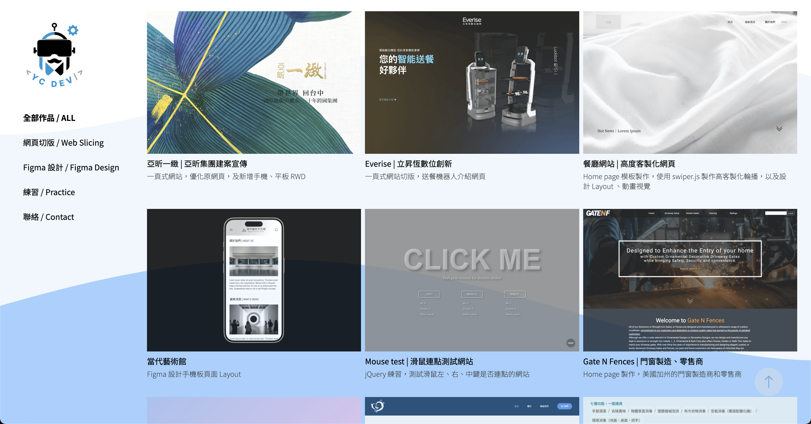

# Front-End Portfolio

這是一個我的前端作品集網站，展示多個網頁切版、Figma 設計與練習專案，並結合動畫與互動效果，提升瀏覽體驗。

## 專案結構

- `index.html`：主頁面
- `css/`：樣式檔案（含 SCSS 原始碼）
- `js/`：JavaScript 功能腳本
- `img/`：網站圖片與 LOGO
- `data/`：專案資料與動畫 JSON

## 使用技術

- HTML5、CSS3（SCSS）、JavaScript（ES6）
- [Bootstrap 5](https://getbootstrap.com/)
- [Lottie-web](https://airbnb.io/lottie/#/web)
- [Google Fonts](https://fonts.google.com/)

## 技術細節

### 1. 分頁切換（分類瀏覽）

- 作品分類（全部、網頁切版、Figma 設計、練習）是透過 JavaScript 動態控制顯示/隱藏，無須重新整理頁面。
- 點擊側邊欄的分類按鈕時，會呼叫 [`filterProjectsByCategory`](js/nav_control.js) 函式，根據按鈕 id 切換顯示對應的作品或聯絡表單。
- 相關程式碼：[js/nav_control.js](js/nav_control.js)

### 2. 作品資料渲染

- 作品資料存放於 [`data/projects.json`](data/projects.json)，由 [`project_covers_rander.js`](js/project_covers_rander.js) 透過 fetch API 讀取並動態渲染至頁面。
- 每個作品會自動產生對應的卡片，包含圖片、標題與描述。
- 相關程式碼：[js/project_covers_rander.js](js/project_covers_rander.js)

### 3. 動畫效果

- 首頁進場動畫與背景波浪動畫皆使用 [Lottie-web](https://airbnb.io/lottie/#/web) 載入 JSON 動畫檔案（`data/loading-animation.json`、`data/wave-lottie.json`）。
- 進場動畫結束後自動淡出，波浪動畫支援滑鼠移動與視窗滾動的視差效果。
- 相關程式碼：[js/intro_animate.js](js/intro_animate.js)、[js/parallax_scrolling.js](js/parallax_scrolling.js)

### 4. 響應式設計

- 使用 SCSS 撰寫，並搭配 Bootstrap 5，確保網站在桌機、平板、手機皆有良好體驗。
- 相關樣式：[css/style.scss](css/style.scss)、[css/style.css](css/style.css)

### 5. LOGO 互動

- LOGO 支援滑鼠移入時自動切換圖片，增加互動感。
- 相關程式碼：[js/logo_control.js](js/logo_control.js)

## 預覽

已透過 Vercel 部署，可直接點擊網址瀏覽本作品集：  
[https://yochen-portfolio.vercel.app/](https://yochen-portfolio.vercel.app/)

---

如有任何建議或問題，歡迎聯絡我！